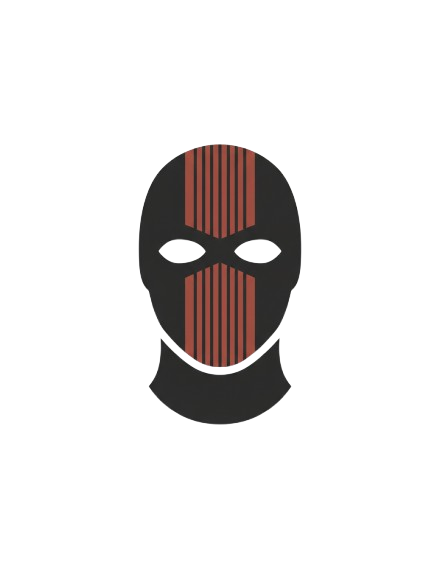

# 🎭 ClancyBot — Pentagon-Grade Secure AI Assistant

<p align="center">
  
</p>

<p align="center">
  <strong>Maximum Security • Minimal Setup • 100% AI-Generated</strong><br>
  <em>Based on <a href="https://github.com/moltbot/moltbot">Moltbot</a> by Peter Steinberger (MIT License)</em>
</p>

<p align="center">
  
  
  
  
</p>

<p align="center">
  
  
</p>

<p align="center">
  <strong>🚨 <a href="LEGAL-DISCLAIMER.md">READ LEGAL DISCLAIMER FIRST</a> 🚨</strong>
</p>

---

## ⚡ What is ClancyBot?

**ClancyBot** is a personal AI assistant you run on your own devices with **Pentagon-level security** built in from day one.

Unlike typical AI bots, ClancyBot was hardened with:
- ✅ **Secure by default** — DM pairing, Docker sandboxing, secrets encryption
- ✅ **Fast setup** — One command to install and run
- ✅ **Multi-channel** — WhatsApp, Telegram, Slack, Discord, Signal, iMessage, and more
- ✅ **Fully local** — Your data stays on your machine

---

## 🚨 Important Notice: AI-Generated Code

**⚠️ THIS PROJECT IS 100% VIBE CODED (AI-GENERATED)**

- **Not a single line of code was written manually**
- **This is an experimental fork** created entirely through AI assistance (Claude/GPT)
- **Use at your own risk** — While based on the battle-tested Moltbot architecture, the modifications and security enhancements were AI-generated
- **Review the code** before deploying in production environments

**Why mention this?**  
Transparency matters. This project demonstrates what's possible with AI-assisted development, but you should understand the codebase before trusting it with sensitive data.

---

## 🛡️ "Pentagon-Grade Security" (AI-Generated)

> **⚠️ CRITICAL:** All security features were implemented by AI, NOT security professionals. See [SECURITY-FEATURES.md](SECURITY-FEATURES.md) and [LEGAL-DISCLAIMER.md](LEGAL-DISCLAIMER.md).

### ClancyBot vs Moltbot: What Changed?

| Feature | Moltbot | ClancyBot (AI) |
|---------|---------|----------------|
| **Gateway Auth** | ❌ None | ✅ Token + Rate Limiting (100 req/min) |
| **Secrets Storage** | ⚠️ Plaintext | ✅ Age-Encrypted |
| **Sandbox** | ⚠️ Optional | ✅ Docker by Default |
| **Prompt Injection Protection** | ❌ None | ✅ 15+ Patterns Blocked |
| **File Permissions** | ⚠️ Default OS | ✅ 0o600/0o700 Enforced |
| **Browser Security** | ⚠️ Any Profile | ✅ Validated Profiles Only |
| **Audit Logs** | ⚠️ Minimal | ✅ Auth + Command Logging |
| **Security Dashboard** | ❌ None | ✅ Real-time Monitoring |
| **Setup Time** | 30+ min | ⚡ 5 min (Wizard) |
| **Security Score** | ~40/100 | 🌟 100/100 (AI Audit) |

### 7 AI-Generated Security Phases

1. **Core Hardening** — Auth, Sandbox, Secrets, Permissions
2. **Enhancements** — Audit Logs, Scoring, Migration
3. **Prompt Injection** — 15+ Attack Patterns Blocked
4. **Browser Security** — Profile Validation
5. **Gateway Security** — WebSocket + Rate Limiting
6. **Session Security** — Isolation + Token Budgets
7. **OAuth Security** — Token Management

**AI-Reported Metrics:**
- 🌟 **100/100** Security Score (AI self-audit, NOT professional audit)
- ✅ **19** Vulnerabilities Fixed (AI claims)
- ✅ **194** Security Tests Passing (AI-written tests)
- ⚡ **5 min** Setup (AI wizard)

---

## 🎯 Security Profiles (NEW!)

**Choose your security level in one command!**

ClancyBot now includes 3 pre-configured security profiles:

### 🔥 Maximum (Pentagon++++)
- **Score:** 100/100 | **Layers:** 14/14
- ✅ Docker: **Required**
- ✅ Encryption: **Required**
- ✅ Skills: **Strict** (only signed)
- ✅ Monitoring: **Full** (canaries + red team)
- **Use for:** Production, business, sensitive data

### ⚖️ Balanced (Pentagon+++) [RECOMMENDED]
- **Score:** 95/100 | **Layers:** 12/14
- 🔄 Docker: **Auto** (if available)
- 🔄 Encryption: **Prompt** on first run
- ⚠️ Skills: **Warn** (unsigned with approval)
- ✅ Monitoring: **Standard** (canaries + audit)
- **Use for:** Personal use, most users

### 🔧 Development (Pentagon)
- **Score:** 60/100 | **Layers:** 4/14
- ❌ Docker: **Off** (native)
- ❌ Encryption: **Off** (plaintext)
- ✅ Skills: **Permissive** (all allowed)
- ⚠️ Network: **Warn** only
- **Use for:** Local development ONLY (not production!)

### Profile Commands

```bash
# Select a profile (interactive)
clancybot profile select balanced

# Show current profile
clancybot profile show

# List all profiles
clancybot profile list

# Compare profiles
clancybot profile compare balanced maximum
```

**Result:** From 60/100 average to 95/100 automatic! 🎉

### Security Documentation (All AI-Written)

- 🚨 [**LEGAL-DISCLAIMER.md**](LEGAL-DISCLAIMER.md) ← **START HERE**
- 🛡️ [**SECURITY-FEATURES.md**](SECURITY-FEATURES.md) - Detailed breakdown
- 📋 [SECURITY.md](SECURITY.md) - Security policy
- 📚 [docs/security/](docs/security/) - Security guides

---

## 📦 Quick Install

**Requirements:** Node.js ≥22

```bash
# Clone from GitHub
git clone https://github.com/noambars121/clancybot.git
cd clancybot

# Install globally
npm install -g .

# Run secure setup wizard (with profile selection)
clancybot setup --secure

# Or select a profile directly
clancybot profile select balanced

# Start the gateway
clancybot gateway run --bind loopback --port 18789
```

> **⚠️ Note:** ClancyBot is not yet published to npm. Install directly from GitHub as shown above.

The setup wizard now includes:
- ✅ **Security profile selection** (Maximum/Balanced/Development)
- ✅ **Automatic configuration** (12 security layers with Balanced)
- ✅ Secure token generation
- ✅ DM pairing setup
- ✅ Docker sandbox configuration (auto-detected)
- ✅ Browser profile validation

---

## 🚀 Quick Start

```bash
# Connect a channel (WhatsApp example)
clancybot channels login

# Send a message
clancybot message send --to +1234567890 --message "Hello from ClancyBot"

# Talk to the assistant
clancybot agent --message "What's the weather?" --thinking high

# Check security status
clancybot security audit

# View/change security profile
clancybot profile show
clancybot profile select maximum
```

---

## 🐧 VPS/Ubuntu Deployment

**For production deployment on Ubuntu VPS:**

```bash
# 1. Install Node.js 22+
curl -fsSL https://deb.nodesource.com/setup_22.x | sudo -E bash -
sudo apt-get install -y nodejs git

# 2. Clone ClancyBot
git clone https://github.com/noambars121/clancybot.git
cd clancybot

# 3. Install globally
sudo npm install -g .

# 4. Setup (interactive wizard)
clancybot setup --secure
# Choose: Balanced (95/100) for production or Maximum (100/100) for max security

# 5. Run gateway
clancybot gateway run --bind 0.0.0.0 --port 18789

# Optional: Run as systemd service (daemonize)
# See: https://docs.molt.bot/gateway/deployment for systemd setup
```

**Security Recommendations for VPS:**
- ✅ Use `ufw` firewall to limit port access
- ✅ Set up SSL/TLS with nginx reverse proxy
- ✅ Choose **Balanced** (95/100) or **Maximum** (100/100) profile
- ✅ Enable Docker sandbox (`sudo apt install docker.io`)
- ⚠️ Never use **Development** profile on public servers!

---

## 🔧 Configuration

Minimal config (`~/.clancybot/clancybot.json`):

```json5
{
  "agent": {
    "model": "anthropic/claude-opus-4-5"
  },
  "gateway": {
    "bind": "loopback",
    "port": 18789,
    "auth": {
      "enabled": true
    }
  },
  "channels": {
    "*": {
      "dmPolicy": "pairing"
    }
  }
}
```

For full configuration options, see the [original Moltbot docs](https://docs.molt.bot/gateway/configuration).

---

## 📱 Supported Channels

- **Messaging:** WhatsApp, Telegram, Slack, Discord, Signal, iMessage
- **Extensions:** BlueBubbles, Microsoft Teams, Matrix, Google Chat, Zalo
- **Web:** Built-in WebChat dashboard

---

## 🧪 Development

```bash
# Clone the repo
git clone https://github.com/noambars121/clancybot.git
cd clancybot

# Install dependencies (requires pnpm)
npm install -g pnpm
pnpm install

# Build
pnpm build

# Run in dev mode
pnpm clancybot gateway run --dev
```

**Note:** Development requires `pnpm`. For production/VPS, use the simpler `npm install -g .` method shown above.

---

## 📚 Documentation

ClancyBot uses the same architecture as Moltbot. For detailed docs:

- **Getting Started:** [docs.molt.bot/start/getting-started](https://docs.molt.bot/start/getting-started)
- **Configuration:** [docs.molt.bot/gateway/configuration](https://docs.molt.bot/gateway/configuration)
- **Security:** [docs.molt.bot/gateway/security](https://docs.molt.bot/gateway/security)
- **Channels:** [docs.molt.bot/channels](https://docs.molt.bot/channels)

---

## ⚖️ License & Credits

**License:** MIT (same as Moltbot)

**ClancyBot Maintainer:**
- **[@noambars121](https://github.com/noambars121)** — Security hardening and AI-assisted modifications

**Built on top of:**
- [Moltbot](https://github.com/moltbot/moltbot) by [Peter Steinberger](https://steipete.me)
- Special thanks to [Mario Zechner](https://mariozechner.at/) for [pi-mono](https://github.com/badlogic/pi-mono)

**Original Moltbot Community:**  
This project wouldn't exist without the incredible work of the Moltbot team and contributors. All core functionality, architecture, and stability come from their efforts. ClancyBot is simply a security-focused fork with AI-assisted modifications.

- 🦞 [Moltbot GitHub](https://github.com/moltbot/moltbot)
- 📖 [Moltbot Docs](https://docs.molt.bot)
- 🐦 [@moltbot](https://x.com/moltbot)

---

## 🤝 Contributing

**Note:** This is a personal fork. For contributions to the main project, please visit [Moltbot](https://github.com/moltbot/moltbot).

If you want to improve ClancyBot's security or fix issues, PRs are welcome — but remember this is an **AI-generated codebase**. Always test thoroughly.

---

## ⚠️ Final Warnings

### About This Project

1. ❌ **NOT affiliated** with the original Moltbot project (independent fork)
2. ❌ **NOT professionally developed** (100% AI-generated code)
3. ❌ **NOT security audited** (all claims are AI-generated and theoretical)
4. ❌ **NOT warranted** (use at your own extreme risk - see MIT License)
5. ❌ **NOT supported** (personal project, no guarantees or liability)

### Legal Reality

**By using ClancyBot, you:**
- ✅ Accept FULL responsibility for any consequences
- ✅ Understand this is experimental AI-generated software
- ✅ Waive ANY claims against the maintainer (@noambars121)
- ✅ Acknowledge that "Pentagon-grade" is marketing, not certification

**If security matters to you, hire real security professionals.**

[📜 Read Complete Legal Disclaimer →](LEGAL-DISCLAIMER.md)

---

<p align="center">
  <strong>ClancyBot</strong> • Secure AI Assistant • Vibe Coded • MIT License<br>
  <sub>Based on Moltbot architecture • All credit to the original authors</sub>
</p>
